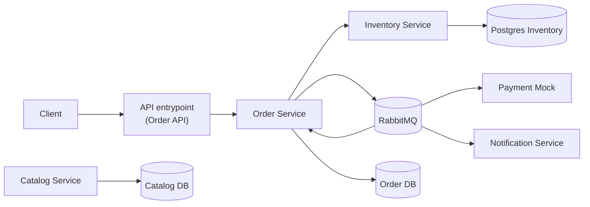

# FlashSale Tickets (monorepo)

<p align="center">
  
</p>

## Модули
- `services/catalog` — каталог событий/билетов (Postgres + Redis‑кэш для чтения событий; есть JPA и интеграционные тесты).
- `services/inventory` — управление бронированием мест:
  - Создание, отмена и просмотр бронирований
  - Проверка доступности мест
  - Автоматическое истечение бронирований (планировщик каждые 60 секунд)
  - Валидация входных данных
  - Обработка ошибок (404, 400, 409 Conflict для недоступных мест)
  - Swagger/OpenAPI документация
- `services/order` — оформление заказов.
- `services/payment-mock` — заглушка платежей.
- `services/notification` — уведомления.

## Архитектура


## Инфраструктура
- Поднять всю обвязку: `cd docker && docker compose up -d`
- Включает: Postgres (3 инстанса), RabbitMQ (5672/15672), Jaeger (16686, OTLP 4317/4318), Prometheus (9090), Grafana (3000), Redis (6379 — кэш каталога).
- Prometheus смотрит на локально запущенные сервисы через `host.docker.internal:8081/8082/8083` (см. `docker/prometheus/prometheus.yml`).
- Grafана уже с провиженингом Prometheus datasource (см. `docker/grafana/provisioning/datasource/datasource.yml`), логин `admin/admin` по умолчанию.

## Сборка и запуск
- Сборка всего: `mvn clean package`
- Запуск отдельного сервиса: `mvn -pl services/<svc> spring-boot:run`  
  (<svc> = catalog | inventory | order | payment-mock | notification)
- Порты по умолчанию (настроены в `application.yml`):
  - `catalog`: 8081
  - `inventory`: 8082
  - `order`: 8083
- Actuator: `/actuator/health`, `/actuator/info`, `/actuator/prometheus`
- OpenAPI UI: `/swagger-ui.html` (доступен для всех сервисов)

### Пример запуска трёх сервисов локально (совместимо с Prometheus targets)
- Каталог: `mvn -pl services/catalog spring-boot:run`
- Инвентори: `mvn -pl services/inventory spring-boot:run`
- Ордер: `mvn -pl services/order spring-boot:run`

## Конфигурация по умолчанию
В каждом сервисе `src/main/resources/application.yml` содержит:
- Порты: `catalog` (8081), `inventory` (8082), `order` (8083)
- health/info/prometheus включены
- тег метрик `application=${spring.application.name}`
- `spring.application.name` выставлен под имя сервиса
- Swagger/OpenAPI настроен для всех сервисов

## Inventory Service API

### Эндпоинты
- `POST /reservation` — создание бронирования
  - Валидация входных данных (userId, eventId, seats)
  - Проверка доступности мест
  - Возвращает 409 Conflict, если места недоступны
- `POST /reservation/{id}/cancel` — отмена бронирования
- `GET /reservation/{id}` — получение деталей бронирования
- `GET /ping` — проверка доступности сервиса

### Обработка ошибок
- `404 NOT_FOUND` — ресурс не найден (ReservationNotFoundException)
- `400 BAD_REQUEST` — невалидный запрос (InvalidReservationException, валидационные ошибки)
- `409 CONFLICT` — места недоступны для бронирования
- `500 INTERNAL_SERVER_ERROR` — внутренняя ошибка сервера

### Планировщик
Автоматическое истечение бронирований каждые 60 секунд:
- Находит бронирования с истекшим сроком
- Обновляет статус на `EXPIRED`
- Освобождает связанные места (меняет статус на `AVAILABLE`)

## Наблюдаемость (Day 1)
Открой `docker/otel/README.md` — там команда для скачивания `opentelemetry-javaagent.jar` и пример запуска:
# FlashSale Tickets

Интервью-ready MVP для flash-sale бронирования билетов: синхронный API, асинхронные события, наблюдаемость (metrics + traces + logs), демо-сценарии и нагрузочный smoke test.

## Архитектура

```
flowchart LR
    Client --> Gateway[API entrypoint\n(Order API)]
    Gateway --> Order
    Order --> Inventory
    Order --> Rabbit[(RabbitMQ)]
    Rabbit --> Payment
    Payment --> Rabbit
    Rabbit --> Order
    Rabbit --> Notification

    Catalog[(Catalog DB)]
    Inventory[(Inventory DB)]
    Orders[(Order DB)]

    CatalogSvc[Catalog Service] --> Catalog
    Inventory --> InventoryDB[(Postgres Inventory)]
    Order --> Orders
```

Сервисы:
- `catalog` (8081): события и места.
- `inventory` (8082): резервации, отмена, экспирация.
- `order` (8083): создание заказа + saga orchestration.
- `payment-mock` (8084): обработка `PaymentRequested` и публикация результата.
- `notification` (8085): consumer reservation-событий с retry + DLQ.

Инфраструктура (`docker/compose.yml`): Postgres x3, RabbitMQ, Prometheus, Grafana, Jaeger, Redis.

## Быстрый старт

```bash
make infra-up
```

Запуск сервисов (локально, в отдельных терминалах):
```bash
mvn -pl services/catalog spring-boot:run
mvn -pl services/inventory spring-boot:run
mvn -pl services/order spring-boot:run
mvn -pl services/payment-mock spring-boot:run
mvn -pl services/notification spring-boot:run
```

## Наблюдаемость

### Grafana
- URL: `http://localhost:3000` (`admin/admin`)
- Дашборд: **FlashSale Observability** (provisioned)
- Панели:
  - latency p95 по сервисам
  - errors (5xx)
  - RPS
  - consumer failures + DLQ size
  - бизнес-метрики: `reserved_count`, `sold_count`, `payment_fail_rate`

### Prometheus
- URL: `http://localhost:9090`
- Scrape targets: catalog/inventory/order/payment/notification + prometheus.

### Tracing
- URL: `http://localhost:16686`
- Поток для демо:
  `Gateway(Order API) → Order → Inventory → RabbitMQ → Payment → RabbitMQ → Order`
- Для связности запросов используйте заголовок `X-Correlation-Id`.

## Demo-сценарий

### 1) Создать резервацию
```bash
curl -s -X POST http://localhost:8082/reservation \
  -H 'Content-Type: application/json' \
  -H 'X-Correlation-Id: demo-flow-1' \
  -d '{"userId":"11111111-1111-1111-1111-111111111111","eventId":"00000000-0000-0000-0000-000000000002","seats":["00000000-0000-0000-0000-000000000003"]}'
```

### 2) Создать заказ (подставить `reservationId`)
```bash
curl -s -X POST http://localhost:8083/orders \
  -H 'Content-Type: application/json' \
  -H 'X-Correlation-Id: demo-flow-1' \
  -d '{"reservationId":"<reservationId>"}'
```
- Отменить бронь: `curl -X POST http://localhost:8082/reservation/<reservationId>/cancel`
- Принудительно истечь: `curl -X POST http://localhost:8082/reservation/expire`

### Где смотреть
- RabbitMQ UI: `http://localhost:15672` (логин/пароль `rabbitmq` / `rabbitmq`)
- Метрики notification: `http://localhost:8080/actuator/prometheus`

### Минимальные метрики
- `processed_total`
- `failures_total`
- `dlq_total`
- `queue_messages{queue="..."}` — backlog для main/retry/dlq

## Быстрые проверки (curl)
- Health: 
  - Catalog: `curl -f http://localhost:8081/actuator/health`
  - Inventory: `curl -f http://localhost:8082/actuator/health`
  - Order: `curl -f http://localhost:8083/actuator/health`
- Prometheus metrics: `curl http://localhost:8082/actuator/prometheus | head -n 5`
- OpenAPI UI: 
  - Catalog: `http://localhost:8081/swagger-ui.html`
  - Inventory: `http://localhost:8082/swagger-ui.html`
  - Order: `http://localhost:8083/swagger-ui.html`
- Ping: `curl http://localhost:8082/ping`

## Зависимости
- Управление версиями в корневом `pom.xml` (BOM Spring Boot, springdoc 2.6.0).
- Общие зависимости сервисов: web, validation, actuator, micrometer-prometheus, springdoc, tests.

## Где смотреть
- Prometheus targets: `http://localhost:9090/targets`
- Grafana datasource/dashboards: `http://localhost:3000` (логин `admin/admin`)
- Jaeger UI (трейсы): `http://localhost:16686`

## Технологии

### Inventory Service
- Spring Boot 3.3.5
- Spring Data JPA (PostgreSQL)
- Spring Validation
- Spring Scheduling (автоматическое истечение бронирований)
- Swagger/OpenAPI (springdoc-openapi 2.6.0)
- Flyway (миграции БД)
- Redis (кэширование)

### Обработка ошибок
- Глобальный обработчик исключений (`GlobalExceptionHandler`)
- Кастомные исключения: `ResourceNotFoundException`, `InvalidReservationException`
- Валидация входных данных через Bean Validation

## Следующие шаги
1. Скачай OTEL агент и запусти сервисы с портами 8081/8082/8083 под OTLP endpoint `http://localhost:4317`.
2. Убедись, что цели в Prometheus зеленые; открой Grafana и Jaeger для проверки метрик/трейсов.
3. При необходимости добавляй JPA/брокер зависимости в сервисные `pom.xml`.
4. Настрой подключение к базе данных PostgreSQL для inventory сервиса (аналогично catalog).

### 3) Проверить заказ
```bash
curl -s http://localhost:8083/orders/<orderId>
```

### 4) Проверить traces/graphs
- Jaeger: найти трейс по service `order`.
- Grafana: открыть `FlashSale Observability`.

## Нагрузочный мини-тест (100 параллельных броней)

```bash
make load-test
```

Или напрямую:
```bash
k6 run scripts/load/reservations.js
```

## OpenAPI

Swagger UI:
- Catalog: `http://localhost:8081/swagger-ui.html`
- Inventory: `http://localhost:8082/swagger-ui.html`
- Order: `http://localhost:8083/swagger-ui.html`
- Payment-mock: `http://localhost:8084/swagger-ui.html`
- Notification: `http://localhost:8085/swagger-ui.html`
